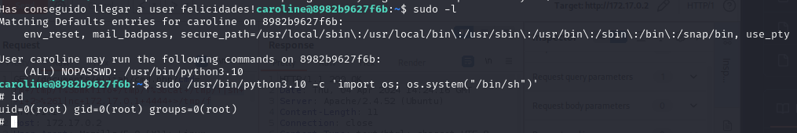

# WriteUp A04

Lo primero que hacemos es un escaneo con nmap.

Vemos que en el servidor ftp podemos iniciar sesión con el usuario ftp, así que vamos a ver qué hay.

Vemos que no hay nada y que tampoco podemos poner archivos. Lo siguiente que haremos sera mirar si las versiones de los servicios que hay son vulnerables.

Vemos que es vulnerable a enumeración de usuarios, así que vamos a intentar enumerar usuarios.

Enumeraos usuarios usando un diccionario de metasploit, pero sin éxito, así que vamos a acceder a la página web para obtener más pistas. Vemos que la página web habla sobre unos personajes de "The Originals", así que vamos a intentar con estos personajes, para ello crearemos un diccionario.

Con esto tenemos un nombre de usuario, ahora vamos a intentar fuerza bruta.

Tenemos usuario y contraseña, así que nos conectamos.

Al intentar conectarnos por ssh vemos que el usuario no tiene acceso por ssh, así que lo hacemos por ftp.

Vemos el directorio *elijah* en el cual podemos subir ficheros, pero nada más interesante, así que vamos a investigar en la página web para ver si tenemos acceso a este directorio y así subir una reverse shell.
Para conseguir más información vamos a hacer fuzzing.

Al hacer el fuzzing descubrimos dos directorios interesantes, ftp y documents. Si entramos en los directorios vemos que no tenemos permisos en ninguno de los dos. Podemos intuir que la carpeta documents está enfocada a los usuarios, así que vamos a intentar crear un archivo en el servidor ftp para ver si tenemos acceso a él.

Ahora vamos a intentar acceder al recurso.

Ya tenemos ejecución remota de comandos

Tras intentar varias reverse shell de comandos de linux y ninguno fuera exitoso, vamos a usar un revrse shell de un [repositorio de github.](https://github.com/pentestmonkey/php-reverse-shell/blob/master/php-reverse-shell.php)

Ya tenemos acceso a la máquina.

Una vez dentro vemos que hay solo un usuario, *caroline* y también vemos una imagen sospechosa.

Nos la descargamos y vemos qué hay.

Al escanear la imagen vemos que tiene un archivo zip instalado, así que lo extraemos y lo abrimos.

Como el zip esta protegido con contraseña la desciframos con jhon.

Al mirar el archivo extraído vemos que tenemos un listado de usuario o de contraseñas, así que vamos a probarlos como contraseña del usuario caroline por ssh.

Tenemos credenciales, así que vamos a iniciar sesión.

## Escalada de privilegios

Para llegar a root vamos a explotar una vulnerabilidad en un permiso suid

## Conclusión

En términos generales, la máquina está bien, ya que es bastante completa y aborda diferentes métodos de explotación. Cabe destacar que todos los métodos empleados para explotar la máquina son métodos ya entrenados previamente en clase. La máquina cumple con su objetivo de vulnerabilidad. Así creemos que es una buena máquina con un nivel bastante fácil.