# WriteUp A08

Lo primero que hacemos es un escaneo con nmap.

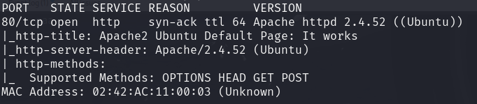

Como solo hay una pagina web y esta nos muestra la default de apache vamos a hacer fuzzing para recolectar mas informacion.

Nos encuentra un wordpress, así que vamos a escanearlo con wpscan.

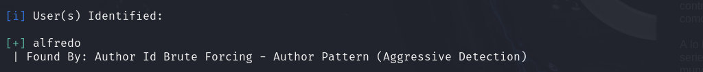
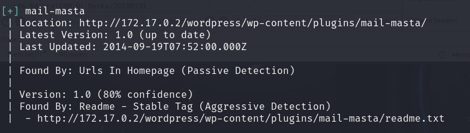

Con esto conseguimos un usuario un pluguin que pude ser vulnerable.

Vamos a usar este repositorio para intentar explotarlo.

https://github.com/p0dalirius/CVE-2016-10956-mail-masta.git

Con esto podemos leer archivos de la maquina

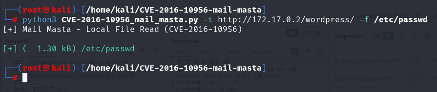
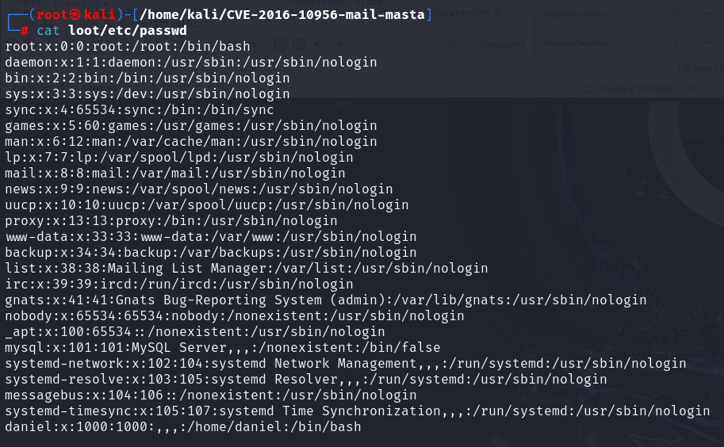

Ahora vamos a buscar archivos de configuracion de wordpress que contienen credenciales para posibles inicios de session.

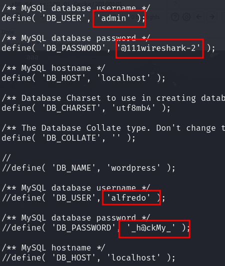

Con estas dos credenciales vamos a intentar inicar sesion.

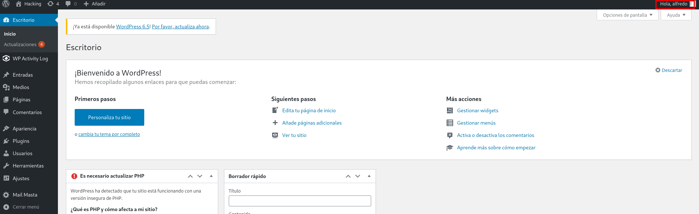

Conseguimos entrar como alfredo haora vamos a intenar modificar una pagina para ejecutar php.
Para ello vamos a crear un servidor en nuestro kali y vamos a intentar hacer una peticion desde el wordpress. Vamos a editar el archvio header.php

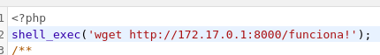
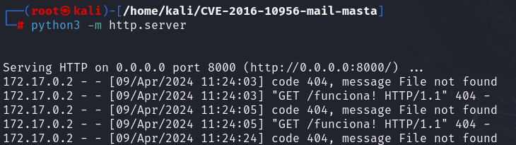

Ahora que podemos ejecutar comandos vamos a crear una reverse sehll
Tras intentar muchos comandos hemos encontrado uno que funciona.

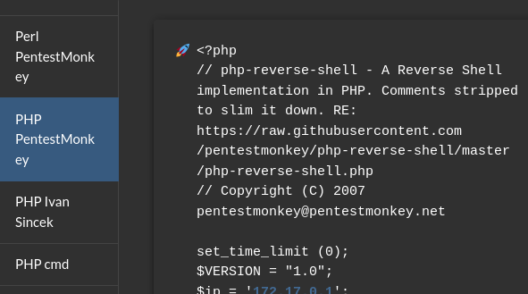

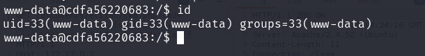

Vamos a intentar cambiar de usuario con las credenciales que tenemos.

Ya somos daniel

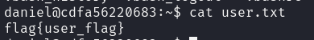

Ya tenemos la flag de usuario, ahora vamos a intentar ser root.

## Escalada de privilegios

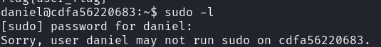

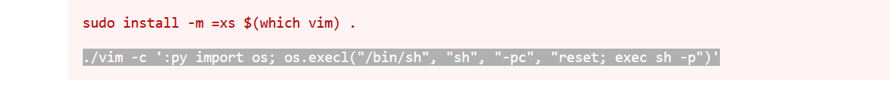

Ya somos root ahora a por la flag.

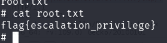

## Conclusión

En términos generales, la máquina parece estar bien, ya que es bastante completa y aborda diferentes métodos de explotación. Es relevante destacar que todos los métodos empleados para explotar la máquina son aquellos que se han enseñado previamente en clase. Encontramos particularmente interesante el acceso a la máquina, que requiere la modificación de un archivo de un plugin. Sin embargo, notamos que la máquina carece un poco de movimiento lateral, lo que la hace sentir un poco limitada en ese aspecto. Como aspecto negativo, observamos que la máquina no inicia automáticamente los servicios, lo que requiere intervenir manualmente para iniciarlos.