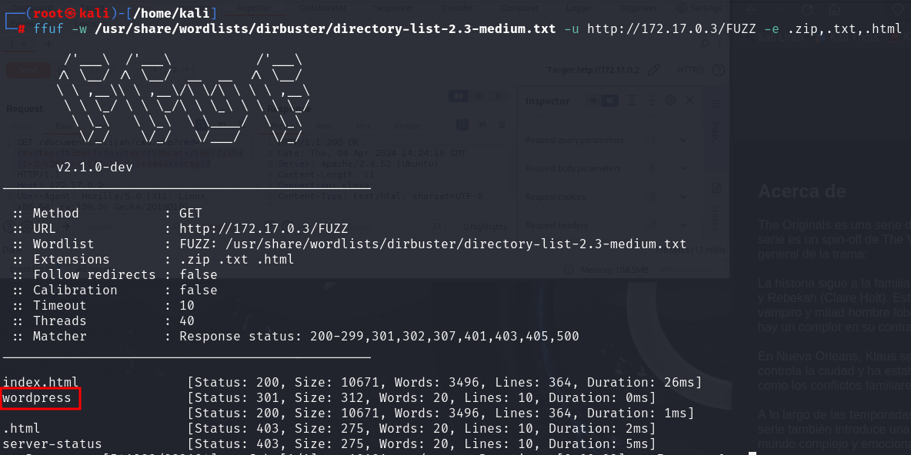
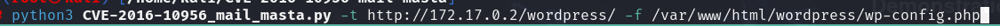
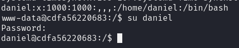
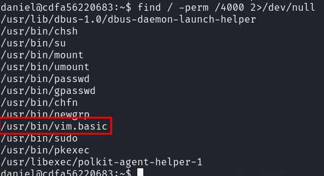

# WriteUp A08

Lo primero que hacemos es un escaneo con nmap.

Como solo hay una pagina web y esta nos muestra la default de apache vamos a hacer fuzzing para recolectar mas informacion.

Nos encuentra un wordpress, así que vamos a escanearlo con wpscan.

Con esto conseguimos un usuario un pluguin que pude ser vulnerable.

Vamos a usar este repositorio para intentar explotarlo.

https://github.com/p0dalirius/CVE-2016-10956-mail-masta.git

Con esto podemos leer archivos de la maquina

Ahora vamos a buscar archivos de configuracion de wordpress que contienen credenciales para posibles inicios de session.

Con estas dos credenciales vamos a intentar inicar sesion.

Conseguimos entrar como alfredo haora vamos a intenar modificar una pagina para ejecutar php.
Para ello vamos a crear un servidor en nuestro kali y vamos a intentar hacer una peticion desde el wordpress. Vamos a editar el archvio header.php

Ahora que podemos ejecutar comandos vamos a crear una reverse sehll
Tras intentar muchos comandos hemos encontrado uno que funciona.

Vamos a intentar cambiar de usuario con las credenciales que tenemos.

Ya somos daniel

Ya tenemos la flag de usuario, ahora vamos a intentar ser root.

