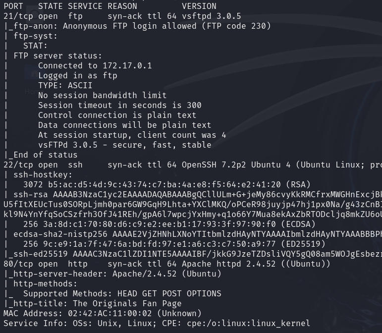
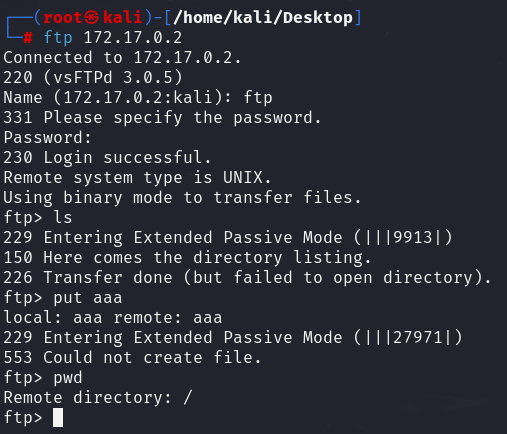
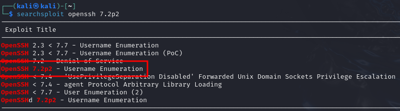
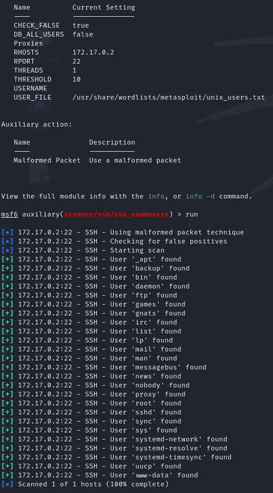
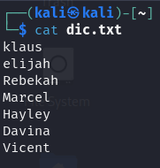
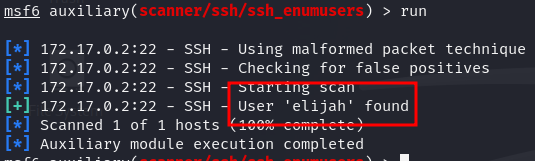
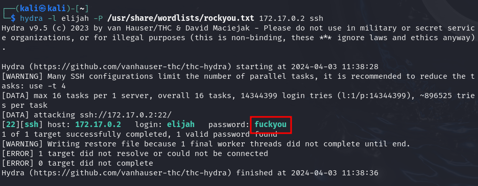
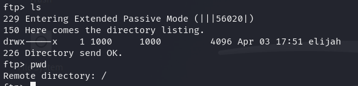

# WriteUp A06

LLo primero que hacmos es un escano con nmap.

Vemos que en el servidor ftp podemos iniciar sesion con el usuaio ftp, así que vamos a ver que hay.

Vemos que no hay nada y que tampoco podmos poner archivos. Lo siguinte que haremos sera mirar si las versiones de los servicios que hay son vulnerables.

Vemos que es vulnerable a enumeracion de usuarios, asi que vamos a intentar enumerar usuarios.

Enumeros usuairos usando un diccionario de metasploit, pero sin exito, asi que vamos a acceder a la pagina web para obtener mas pistas. Vemos que la pagina web habla sobre unos personajes de "The Originals", asi que vamos a intentar con estos personajes, para ello crearemos un diccionario.

Con esto tenemos un nombre de usuario, haora bamos a intentar fuerza bruta.

Tenemos usuario y contraseña, así que nos conectamos.

Al intentar connectarnos por ssh vemos que el usurio no tiene acceso por ssh, asi que lo hacemos por ftp.

Vemos el directorio *elijah* en el cual podemos subir ficheros, pero nada mas interesante, así que vamos a investigar en la pagina web para ver si tenemos acceso a este directorio i así subir una reverse shell.
Para conseguir mas información vamos a hcer fuzzing.
