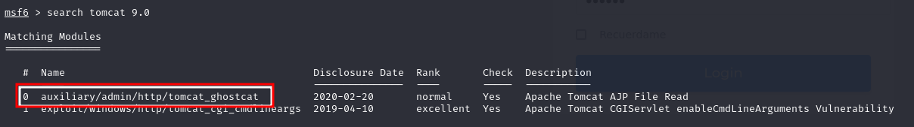
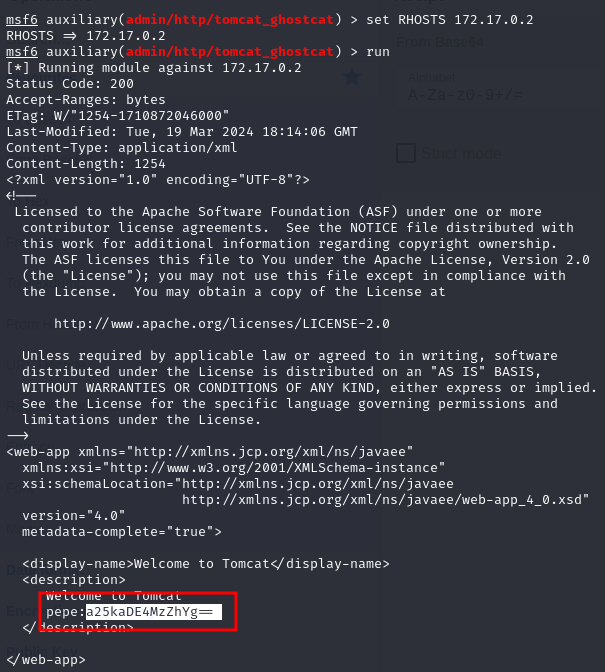
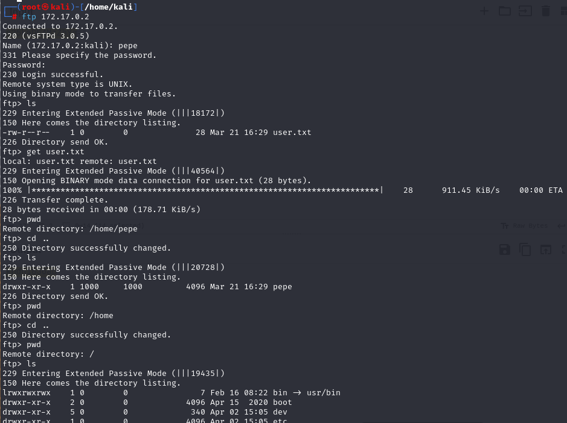
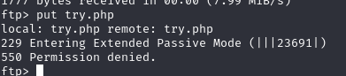
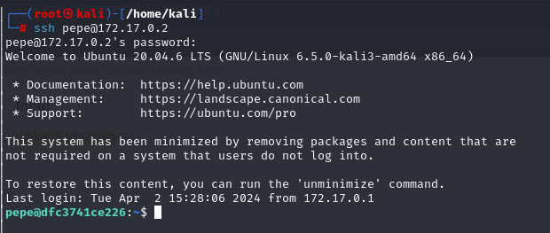
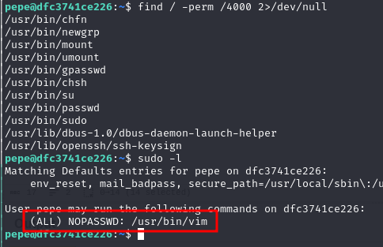
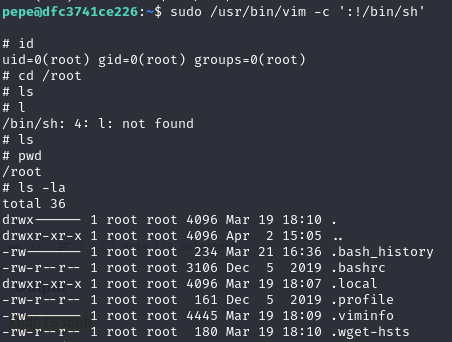
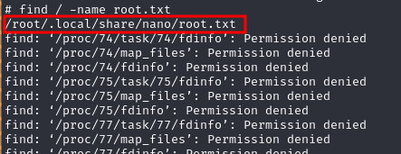
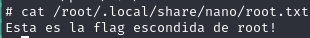

# WriteUp Tu 1 millón

## Inicio del Docker.

Lo primero que hemos hecho es descargar e iniciar el Docker.

Una vez descargado el Docker lo iniciamos y buscamos. Para buscarlo lo hacemos con la herramienta arp-scan.

Una vez lo encontramos le hacemos un nmap para ver los puertos abiertos.

``nmap -sCV -p- --open --min-rate 5000 -T5 sS -vvv -n 172.17.0.2 -oN scan``

Vamos a buscar si los servicios que tiene instalados son vulnerables.

Vemos que el tomcat que tiene instalado si que es vulnerable, así que vamos a intentar explotarlo.

Al hacerlo vemos unas credenciales cifradas y si las desciframos obtenemos las siguientes credenciales.

``pepe:kndh1836ab``

Vamos a intentar acceder por ftp.

Con esto obtenemos la flag de usuario. También vemos que tenemos acceso a todo el sistema. Así que vamos a intentar subir un archivo para conseguir una reverse shell.

He intentado subir una reverse shell, pero no tenemos privilegios, así que vamos a intentar iniciar session por ssh.

Vamos a intentar acceder a root, para ello vamos a hacer los comandos básicos para la escala de privilegios.

Vamos, que podemos ejecutar vim como root, así que vamos a buscar en GTFOBins para la escalada de privilegios.

¡Ya tenemos acceso a root!

Ahora vamos a buscar la flag de root. Para ello vamos a buscar-la.

¡Ya la tenemos!

## Conclusión

En resumen, creemos que la máquina es demasiado simple, ya que nos hubiera gustado que las vulnerabilidades y la escalada de privilegios hubiera sido más complicada, así como más movimiento lateral dentro de la máquina, pero aun así cumple con la vulnerabilidad del OWASP al tener el Tomcat vulnerable.
