# índice

1. [Introducción](#introducción)
2. [Informacion Sobre los Riesgos Obtenidos](#informacion-sobre-los-riesgos-obtenidos)
    - [Inyeccion](#inyeccion)
    - [Fallas de Identificación y Autenticacion](#fallas-de-identificacion-y-autenticación)
3. [Información Sobre los Componentes Fundamentales](#información-sobre-los-componentes-fundamentales)
    - [MariaDB](#mariadb)
    - [Docker](#docker)
    - [Apache](#apache)
    - [PHP](#php)
8. [Desarrollo Contenedor Numero 1 - Inyección](#contenedor-numero-1-inyección)
    - [Contenedor 1 Vulnerabilidades CVE Extra](#Contenedor-1-vulnerabilidades-cve-extra)
    - [Contenedor 1 Creación del CTF](#Contenedor-1-creación-del-ctf)
    - [Contenedor 1 Análisis del Contenedor una vez Explotado](#Contenedor-1-análisis-del-contenedor-una-vez-explotado)
    - [Contenedor 1 Walkthrough](#Contenedor-1-walkthrough)


9. [Desarrollo Contenedor Numero 2 Fallas de Identificación y Autenticación](#contenedor-numero-2-fallas-de-identificación-y-autenticación)
    - [Contenedor 2 Vulnerabilidad CVE Extra](#Contenedor-2-vulnerabilidad-cve-extra)
    - [Contenedor 2 Creación del CTF](#Contenedor-2-creación-del-ctf)
    - [Contenedor 2 Análisis del Contenedor](#Contenedor-2-análisis-del-contenedor)
    - [Contenedor 2 Walkthrough](#Contenedor-2-walkthrough)


# [Introducción](#índice)

El propósito principal de este documento es mostrar la creación de dos contenedor en Docker con los siguientes riesgos del OWASP TOP 10:

- **A03:2021 - Inyección**
- **A07:2021 - Fallas de Identificación y Autenticación**

Cada uno de los 2 contenedores tendrá únicamente 1 riesgo de los mencionados. Por otro lado, se implementarán vulnerabilidades descubiertas de 2023 en adelante.

A continuación se explicarán en profundidad los riesgos mencionados, desde la descripción hasta la mitigación.

# [Informacion Sobre los Riesgos Obtenidos](#índice)

## [Inyeccion](#índice)

Es un riesgo de inserción de código malicioso en una entrada de datos para obtener acceso no autorizado o realizar acciones no deseadas.
<p align="center">

</p>

**Ataques de Inyección**

- **SQL Injection:** Se insertan comandos SQL maliciosos en las entradas de datos de una aplicación web. 

- **XSS:** Este tipo de ataque implica la inserción de scripts maliciosos en páginas web accesibles por otros usuarios.

- **Command Injection:** Los atacantes insertan comandos del sistema operativo en entradas de datos de aplicaciones para ejecutar comandos arbitrarios en el servidor. 

- **LDAP:** Los atacantes pueden manipular consultas LDAP para obtener acceso no autorizado a la información para realizar acciones no deseadas en el sistema.

- **XPath Injection:** Se dirige a sistemas que utilizan expresiones XPath para realizar consultas en documentos XML.

**Impacto**

Las inyecciones pueden dar lugar a la obtención y distribución no autorizada de información sensible, alteración de datos, ejecución remota de comandos, o incluso la toma de control completo del sistema. Estos riesgos pueden tener repercusiones significativas en la integridad, confidencialidad y disponibilidad de los sistemas y datos afectados.

**Mitigación**

Para prevenir los ataques de inyección podemos emplear las siguientes medidas:

- **Validación de Entradas de Usuario:** Validar y filtrar todas las entradas de usuario.

- **Parámetros Preparados:** Utilizar consultas parametrizadas.

- **Escapado de Caracteres:** Escapar los caracteres especiales antes de incluirlos en consultas SQL.

- **Validación de Datos de Formulario:** Validar y filtrar los datos del formulario. 

- **Privilegios Mínimos:** Limitar los permisos de los usuario y servicios para que tengan los privilegios mínimos necesarios para realizar sus funciones.

- **Actualizaciones y Parches:** Mantener actualizados todo el software.

- **Seguridad en la Capa de Red:** Utilizar firewalls y sistemas de detección de intrusiones para monitorear y filtrar el tráfico malicioso.

- **Educación:** Educar a las perosnas sobre las mejores prácticas de seguridad.

# [Fallas de Identificacion y Autenticación](#índice)

Las fallas de identificación y autenticación es un riesgo relacionado con la gestión de credenciales de usuario y los procesos de verificación de identidad en sistemas informáticos. Este riesgo permite a los atacantes acceder de forma no autorizada a datos sensibles.
<p align="center">

</p>

**Causas comunes de fallas de identificación y autenticación**

- **Contraseñas Débiles:** Las contraseñas deben cumplir unos requisitos mínimos para estar clasificadas como "no débiles".

- **Falta de Autenticación Multifactor (MFA):** La autenticación multifactor agrega una capa adicional de seguridad.

- **Reutilización de Contraseñas:** Si los usuarios utilizan la misma contraseña para múltiples servicios, el compromiso de una sola cuenta puede poner en riesgo todas las demás cuentas asociadas con esa contraseña.

- **Falta de Protección contra Ataques de Fuerza Bruta:** Los atancates que usan fuerza bruta intentaran adivinar las contraseñas probando una gran cantidad de combinaciones posibles. 

- **Falta de Monitoreo y Detección de Anomalías:** Permite que los atacantes accedan a los sistemas sin ser detectados.

- **Falta de Educación del los Usuarios:** No informar a los usuarios de las mejores prácticas de seguridad.

**Impacto**

Este riesgo puede derivar en acceso no autorizado, suplantación de identidad, exposición de credenciales y violación de privacidad. Las consecuencias incluyen la posibilidad de pérdida de datos, violación de la privacidad, y riesgos de cumplimiento normativo.

**Mitigacion**

- **Contraseñas Seguras:** Establecer requisitos mínimos de complejidad de contraseña (longitud, caracteres especiales, combinación de letras mayúsculas y minúsculas) 

- **Autenticación Multifactor:** Implementar la autenticación multifactor para agregar una capa adicional de seguridad.
  
- **Gestión de Sesiones:** Implementar mecanismos para gestionar adecuadamente el tiempo de conexion de los usuarios.
  
- **Protección contra Ataques de Fuerza Bruta:** Bloquear una cuenta después de varios intentos de inicio de sesión fallidos.

- **Monitoreo de Actividad de Usuario:** Implementar sistemas de monitoreo para detectar y responder a actividades de usuarios anómalas o maliciosas.

- **Educación del Usuario:** Educar a los usuarios sobre prácticas seguras de autenticación.

- **Actualizaciones y Parches:** Mantener actualizados los sistemas y aplicaciones.

# [Información Sobre los Componentes Fundamentales](#índice)

## [MariaDB](#índice)

 **¿Qué es Mariadb?**
 
MariaDB es un sistema de gestión de bases de datos de código abierto que ofrece poder almacenar y manipular datos de manera eficiente.

 <p align="center">

</p>

 **Ventajas y desventajas de MariaDB**

**Ventajas:**

- **Compatibilidad con MySQL:** Es compatible con la mayoría de las aplicaciones y herramientas diseñadas para MySQL. 

- **Código abierto:** Es un proyecto de código abierto.

- **Comunidad activa:** Cuenta con una comunidad de usuarios.

- **Compatibilidad con estándares:** MariaDB cumple los  estándares SQL.

 **Desventajas:**
 
- **Complejidad de Migración:** Si estás migrando desde otro sistema de gestión de bases de datos (DBMS), la complejidad de la migración puede ser bastante complicada.

- **Menor Frecuencia de Actualizaciones:** MariaDB se suele actualizar menos en comparación con otros sistemas de bases de datos. Esto implica que no tenga las últimas características y mejoras de seguridad.

 **Instalacion y Configuración** 

Para instalar y poner contraseña a root ejecutamos los siguientes comandos:

```
apt install mariadb-server
service mariadb start
mariadb
```

Una vez dentro:

```
USE mysql;
ALTER USER 'root'@'localhost' IDENTIFIED BY 'contraseña';
flush privileges;
exit;
```
        
Una manera alternativa de configurar esto es ejecutando el siguiente comando:

```
sudo mysql_secure_installation
```

## [Docker](#índice)

 **¿Qué es Docker?**

Docker es una plataforma de código abierto diseñada para facilitar la creación, implementación y ejecución de aplicaciones dentro de contenedores. Los contenedores son entornos de software ligeros y portátiles que encapsulan todo lo necesario para que una aplicación se ejecute, incluidas las bibliotecas, dependencias y otros componentes, lo que les permite funcionar de manera consistente en cualquier entorno.
<p align="center">

</p>

 **Ventajas y desventajas de Docker**

 **Ventajas:**

- **Portabilidad:** Los contenedores Docker proporcionan una forma fácil y rápida de empaquetar una aplicación y todas sus dependencias en un entorno aislado.

- **Ligereza:** Los contenedores Docker son ligeros y rápidos de crear, iniciar y detener.

- **Aislamiento:** Docker proporciona un alto nivel de aislamiento entre contenedores cada contenedor tiene su propio sistema de archivos.


**Desventajas:** 

- **Comunidad Fragmentada:** Diferentes tipos opiniones dentro de la comunidad de usuarios, dificultad en la colaboración dentro de la comunidad.

- **Rendimiento:** El rendimiento de la virtualización a nivel de contenedor en menor que las aplicaciones fuera del contenedor.


 **Instalacion de Docker**
Para instalar debemos seguir los siguientes pasos:

**1. Añadir clave GPC de docker:**

```
curl -fsSL https://download.docker.com/linux/ubuntu/gpg | sudo apt-key add -
```

**2. Añadir repositorio oficial de docker:**

```
sudo add-apt-repository "deb [arch=amd64] https://download.docker.com/linux/ubuntu focal stable
```
    
**3. Instalacion docker:**

```
sudo apt install docker-ce docker-ce-cli containerd.io
```

## [Apache](#índice)

Apache es un servidor web de código abierto.

<p align="center">

</p>

 **Ventajas y desventajas de Apache:**
 
 
**Ventajas:**

- **Código Abierto:** Es un software de código abierto.


- **Soporte para múltiples plataformas:** Apache es compatible con una amplia gama de sistemas operativos.

- **Comunidad activa::** Apache cuenta con una gran comunidad de usuarios. 

**Desventajas:**


- **Consumo de recursos:** Requiere más recursos que otros servidores web.
  

 **Instalacion de Apache:**

Para instalar apache tienes que poner este comando:

```
sudo apt install apache2
```

## [PHP](#índice)

PHP es un lenguaje de programación de código abierto interpretado del lado del servidor.

<p align="center">

</p>


 **Ventajas y desventajas de PHP:**
 
**Ventajas:**


- **Integración con HTML:** PHP se puede integrar fácilmente con HTML

- **Soporte para Bases de Datos:** PHP tiene un soporte para la gestión de bases de datos.

- **Comunidad activa::** PHP cuenta con una gran comunidad de usuarios. 

**Desventajas:**


- **Rendimiento:** En comparación con otros lenguajes de programación PHP puede tener un rendimiento relativamente inferior depende de la circunstancia.


 **Instalacion de PHP:**

Para instalar PHP tienes que poner este comando:

```
sudo apt install libapache2-mod-php
```

# [Contenedor Numero 1 Inyección](#índice)

El sistema operativo utilizado para el desarrollo de este primer contenedor es Ubuntu Server XX. La vulnerabilidad elegida ha sido SQL Injection. Es por ello que el desarrollo de esta estará basado en un formulario cuyos campos serán vulnerables a este tipo de ataque. 

<p align="center">

</p>


## [Contenedor 1 Vulnerabilidades CVE Extra](#índice)

Para realizar la búsqueda de las CVEs añadidas como extra en la máquina, hay que tener en cuenta los siguientes puntos:
- **La CVE debe ser del año 2023 o posterior**
- **La CVE debe ser reproducible**
- **La CVE debe tener un exploit desarrollado**

CVE Extra elegida para su reproducción:

- **CVE-2023-37629**

Esta vulnerablidad permite al usuario subir archivos maliciosos con el fin de obtener acceso al servidor, por ejemplo un script en php que ejecute una reverse shell.

**Mitigación**

Para mitigar esta vulnerabilidad lo único que debemos hacer es sanitizar la subida de archivos, permitiendo únicamente la subida de imágenes y nada más.

- **CVE-2023-32784**

Esta vulnerablidad permite al usuario dumpear la clave maestra de KeePass en texto claro, permitiendo así un posible escalado de privilegios.

**Mitigación**

Para mitigar esta vulnerabilidad lo único que debemos hacer es actualizar la versión.

## [Contenedor 1 Creación del CTF](#índice)

Para el desarrollo del formulario hemos empleado únicamente HTML, CSS y PHP.

- **HTML:** Estructura del formulario
- **CSS:** Personalización del formulario
- **PHP:** _Backend_ del formulario (validación & conexión con la base de datos)

El script en php está hecho de manera que no valida correctamente la entrada. De esta manera es vulnerable a inyección SQL.

Representación gráfica de la validación errónea:

<p align="center">
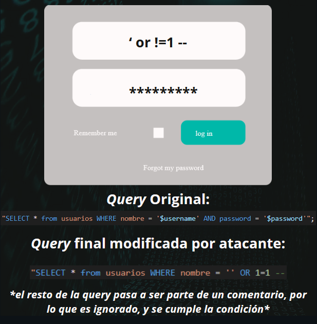
</p>

Apariencia final del formulario:

<p align="center">
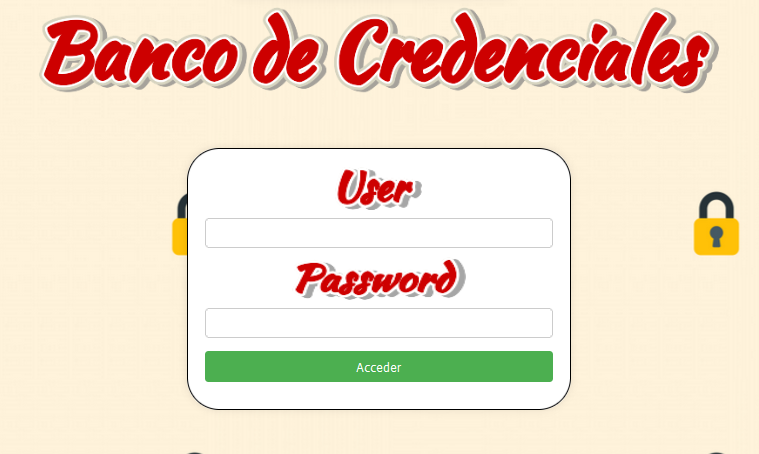
</p>

Para el desarrollo del primer contenedor, instalamos Docker siguiendo el [tutorial](https://docs.docker.com/engine/install/ubuntu/#install-using-the-repository) de la documentación oficial de Docker. Una vez hecho esto comenzamos con la creación del contenedor de manera manual:

<p align="center">
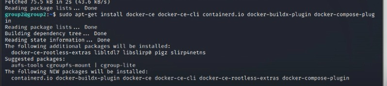
</p>

Descargamos la imagen de ubuntu para docker:

<p align="center">
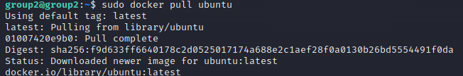
</p>
<p align="center">
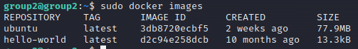
</p>

A continuación creamos el contenedor con esta imágen:

<p align="center">
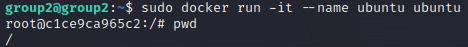
</p>

Prueba Instalación MariaDB:

Para instalar y poner contraseña a root dentro del contenedor:

```
apt install mariadb-server
service mariadb start
mariadb
```

Una vez dentro:

```
USE mysql;
ALTER USER 'root'@'localhost' IDENTIFIED BY 'contraseña';
flush privileges;
exit;
```

A continuación accedemos con el usuario root con el comando:

```
mysql -u root -p
```

Para crear la base de datos y un usuario válido en el formulario SQLi:

```
CREATE DATABASE db1;
use db1;
CREATE TABLE users(id CHAR(30) NOT NULL,user CHAR(20) NOT NULL,password CHAR(20) NOT NULL);
INSERT INTO users VALUES ('0','usuarioPrivilegiado','passUserPriv1');
```

Comprobación:

<p align="center">
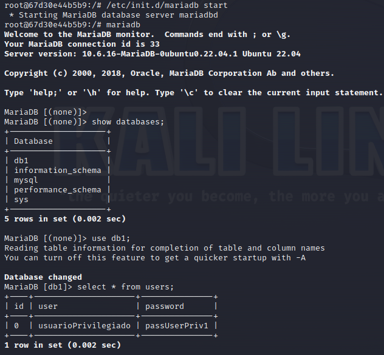
</p>

Instalación PHP y Prueba Conexión DB con Validador

Instalamos php y sus respectivos módulos:

<p align="center">

</p>

Prueba Creación de Snapshot en Docker

Comando empleado:

```
sudo docker commit ubuntu ubuntu1
```

<p align="center">
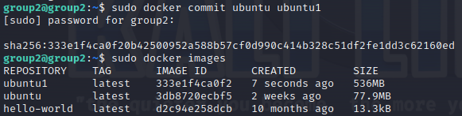
</p>

Y para ejecutarla:

```
sudo docker run -it --name ubuntu1 ubuntu1
```

<p align="center">
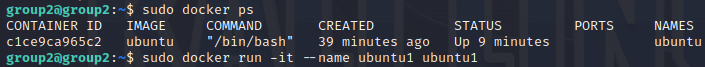
</p>

Implementación CVE Extra (CVE-2023-37629)
 
En primer lugar descargamos el software y lo descomprimimos en la ruta /var/www/html. Una vez hecho esto creamos la base de datos:

<p align="center">
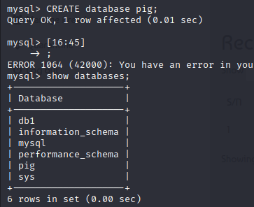
</p>

A continuación importamos el archivo .sql que viene con el software, y verificamos que se hayan creado las tablas:

<p align="center">
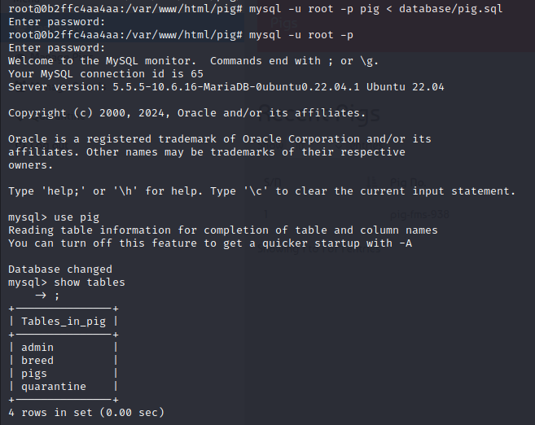
</p>

Finalmente comprobamos accediendo mediante el navegador:

<p align="center">
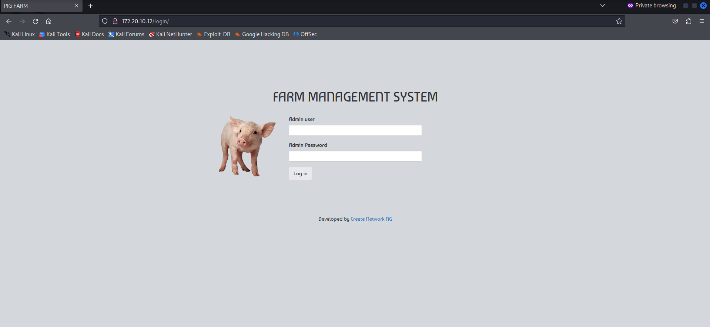
</p>

E iniciamos sesión para verificar que está conectado con la base de datos de igual manera:

<p align="center">
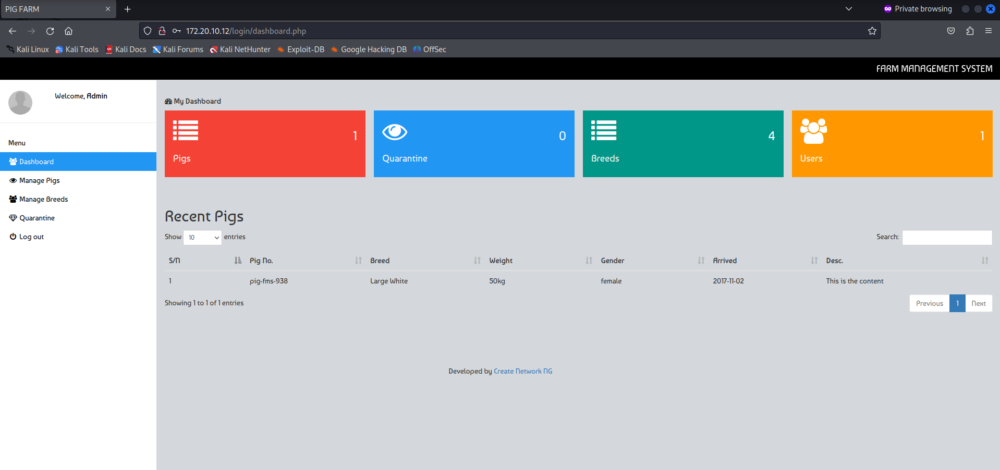
</p>

Creación de Usuarios:

Creamos todos los usuarios que formarán parte del CTF, entre los que se encuentran:

- pastorPaco 
- pastorJose
- granjero

<p align="center">

</p>

El escalado a root se hará desde el usuario "granjero". El usuario "pastorPaco" será el usuario puente hacia "granjero". Y el usuario "pastorJose" es un simple _rabbit hole_.

Implementación de Logs

Para poder realizar un análisis forense una vez explotada la máquina, hemos mejorado el código de los scripts de validación de ambos formularios con la finalidad de almacenar logs de inicio de sesión, almacenando los campos introducidos por el cliente:

<p align="center">
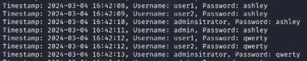
</p>

## [Contenedor 1 Análisis del Contenedor una vez Explotado](#índice)
Para analizar la maquina explotada primero hemos mirado los logs que tenemos en la maquina docker.

Tenemos los siguientes logs en nuestro docker:

- Logs de inicio de sesion de la pagina farm.

<p align="center">

</p>

- Logs de inicio de sesion de la pagina banco.
<p align="center">

</p>

- Logs de apache para ver los post y los get.
  
- Logs de mariadb para ver las querris.

## [Contenedor 1 Walkthrough](#índice)

En primer lugar hacemos un escaneo de puertos para ver qué puertos hay abiertos:

<p align="center">
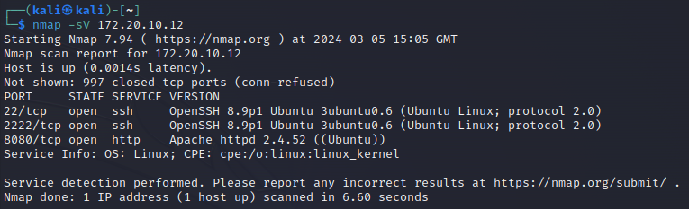
</p>

A continuación accedemos vía navegador al puerto 80 para ver la web:

<p align="center">
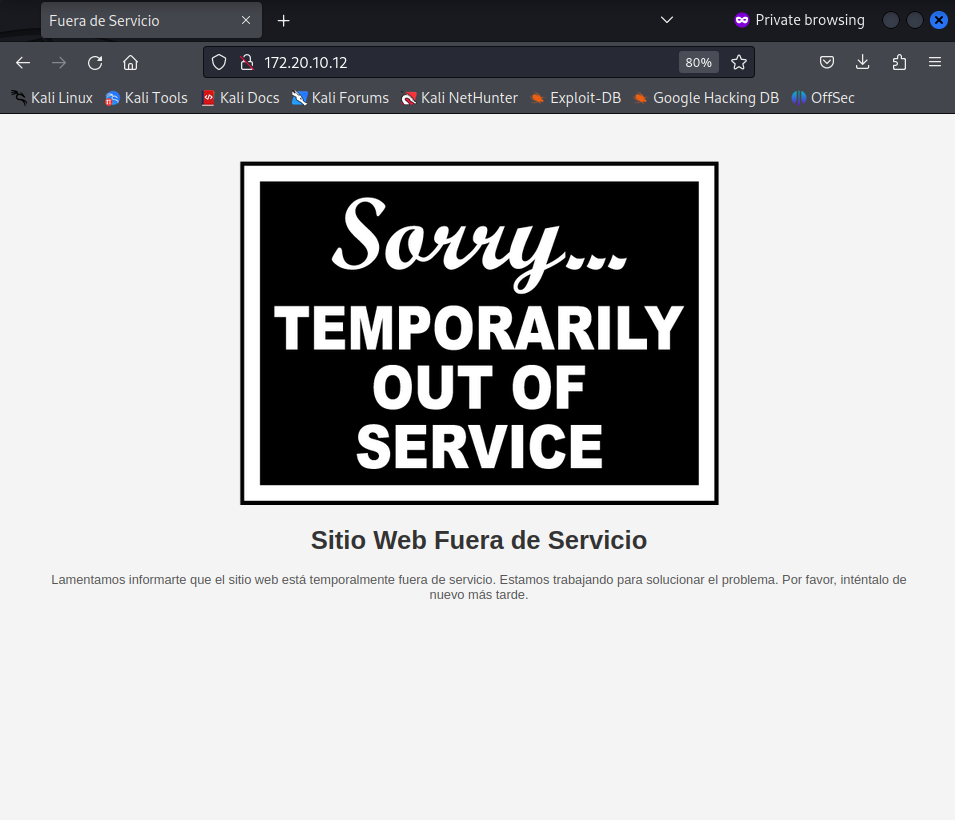
</p>

Parece que no hay nada interesante, hacemos un ataque de fuzzing al URL para ver posibles directorios ocultos y encontramos el siguiente:

<p align="center">
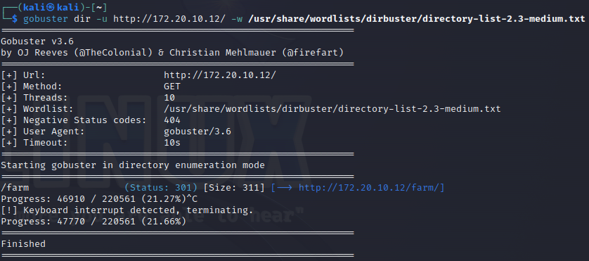
</p>

Accedemso y aparentemente hay un panel de inicio de sesión. No parece ser vulnerable, así que intentamos hacer fuerza bruta sobre este formulario con BurpSuite:

<p align="center">
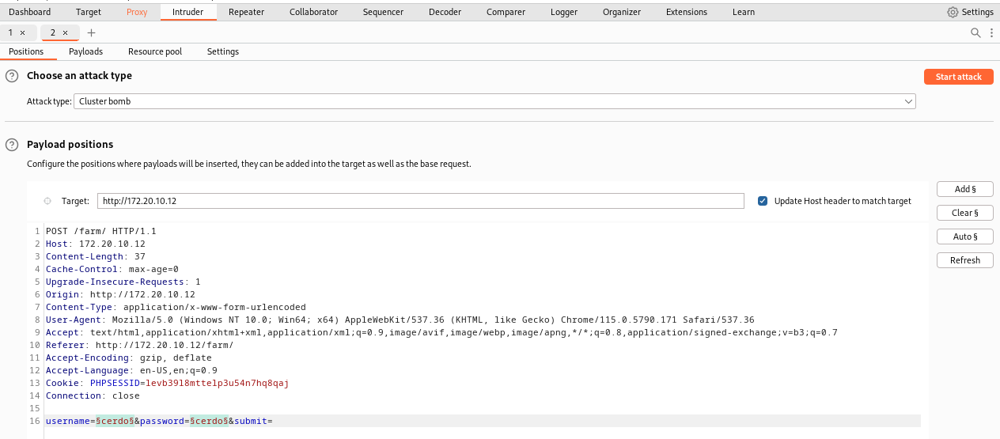
</p>

<p align="center">
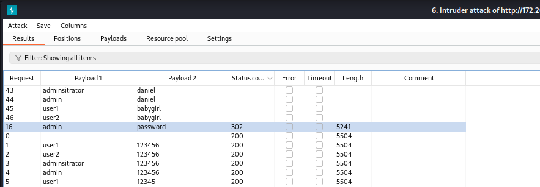
</p>

Se diferencia un código de status 302, por lo que probamos esas credenciales y en efecto son funcionales:

<p align="center">
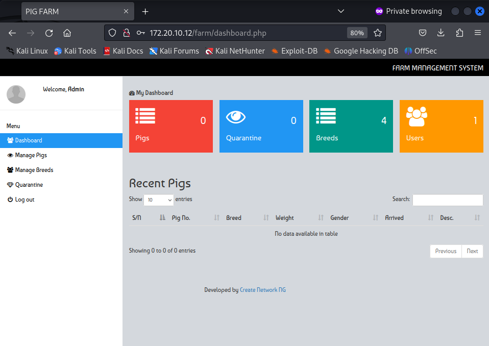
</p>

A continuación exploramos un poco el panel de administración y encontramos una función donde puedes añadir un cerdo a la base de datos. En este formulario te deja subir una imagen, sin embargo se nos permite subir un archivo .php ya que no está bien sanitizado:

<p align="center">
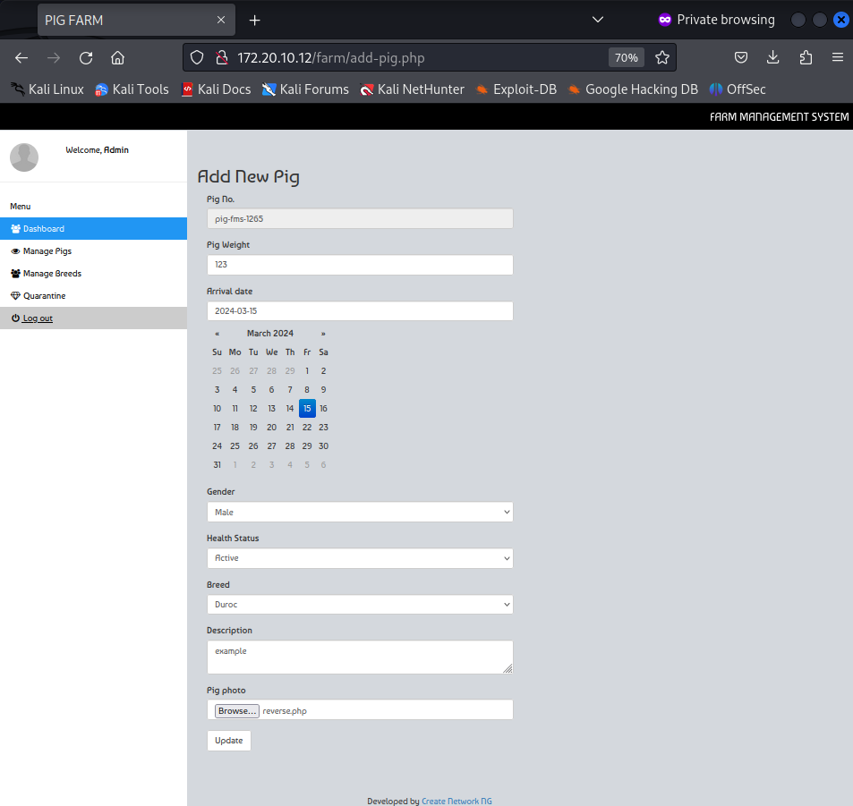
</p>

<p align="center">
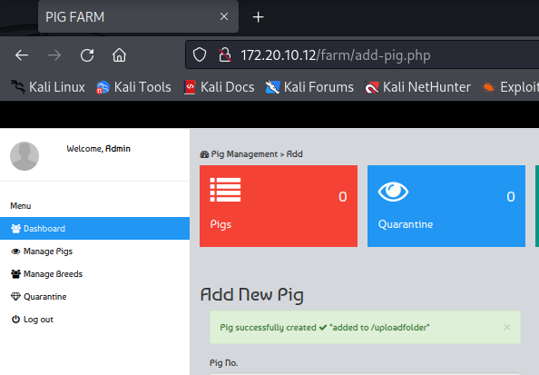
</p>

A continuación ponemos un puerto en escucha y ejecutamos el archivo .php que hemos subido y cuya función es ejecutar una reverse shell:

<p align="center">
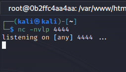
</p>

<p align="center">
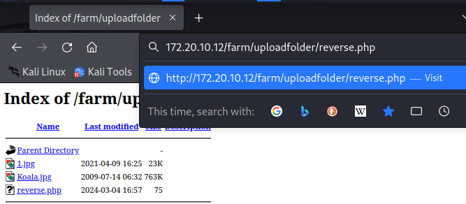
</p>

Y ya estamos conectados a la máquina con el usuario **www-data**:

<p align="center">
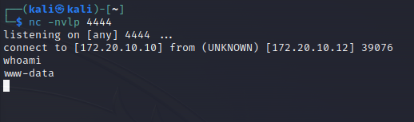
</p>

Con este usuario encontramos un directorio diferente dentro de /html:

<p align="center">
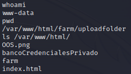
</p>

Accedemos vía navegador y encontramos otro panel de inicio de sesión:

<p align="center">
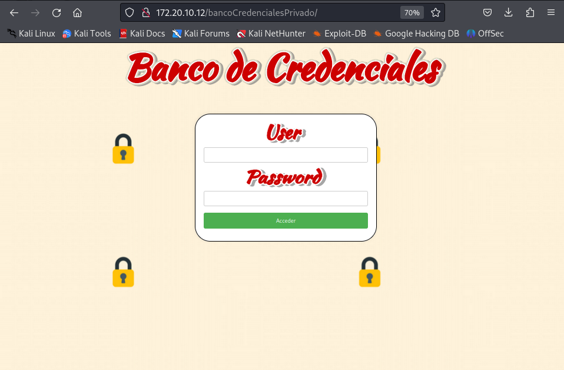
</p>

Afortunadamente este sí es vulnerable a SQL Injection por lo que nos facilita en gran medida el bypass de acceso:

<p align="center">
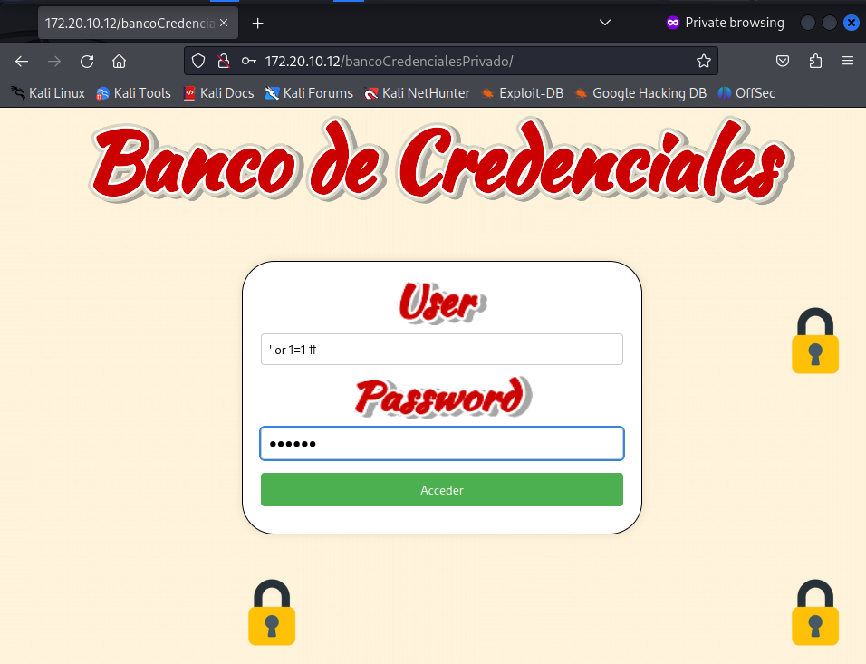
</p>

Una vez hecho el bypass, nos redirige a un "banco de credenciales" donde parece haber las credenciales de varios usuarios, aparentemente encodeadas en Base64:

<p align="center">
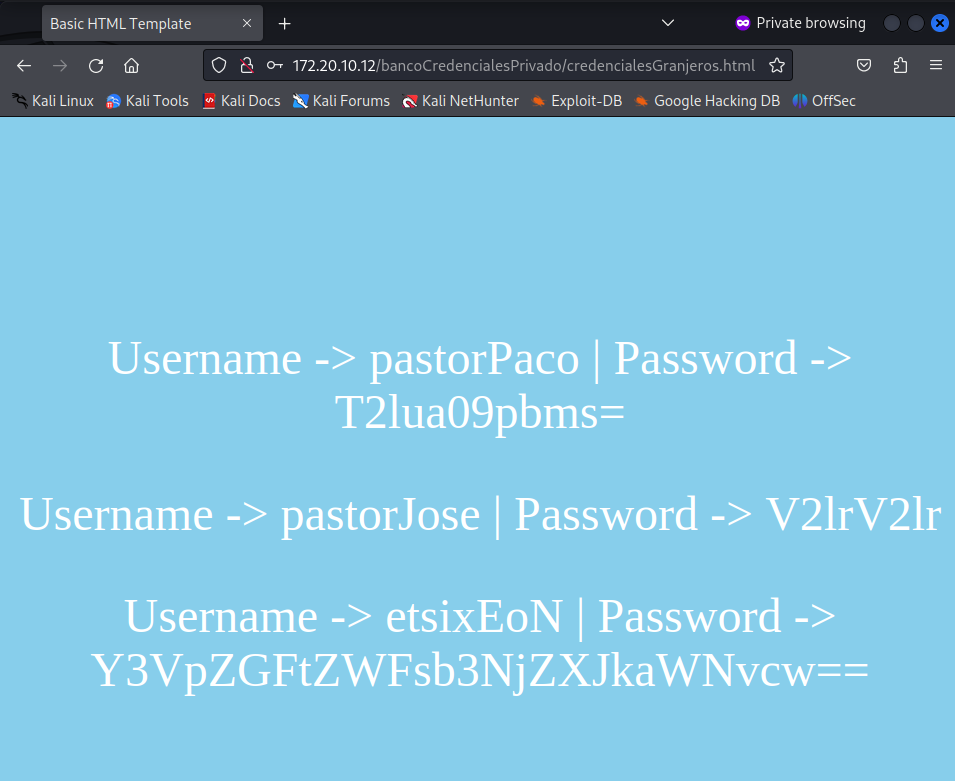
</p>

Lo desencodeamos:

<p align="center">
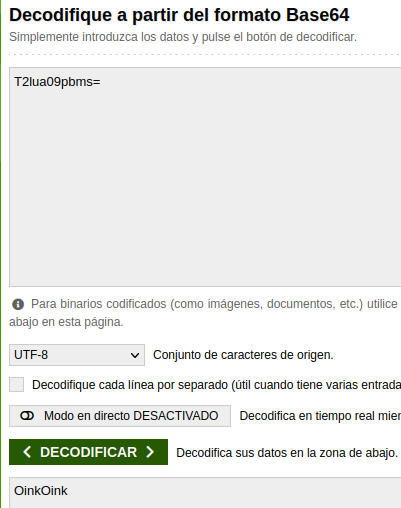
</p>

Y obtenemos una posible contraseña. A continuación nos conectamos vía SSH para probar si funciona:

<p align="center">
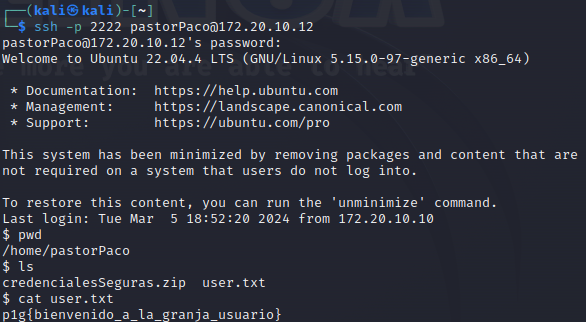
</p>

Accedemos correctamente, y lo primero que encontramos es un archivo .zip protegido con contraseña y la flag "user.txt", así que nos los llevamos a la máquina atacante mediante SCP y probamos a hacer fuerza bruta por si la contraseña fuese débil. Obtenemos el hash del zip e iniciamos el ataque:

<p align="center">
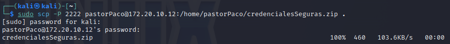
</p>

<p align="center">
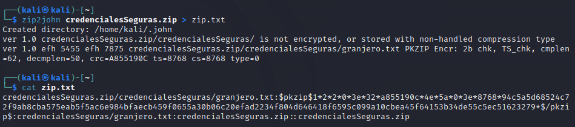
</p>

Al realizar el ataque descubrimos la contraseña del zip, al extraerlo vemos que dentro de este hay un archivo llamado "granjero.txt":

<p align="center">
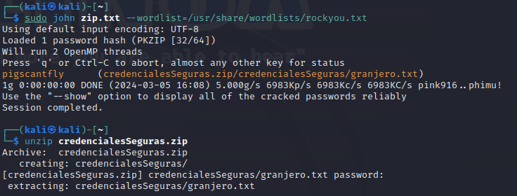
</p>

Al listar el contenido vemos las credenciales de un usuario nuevo, cuya contraseña está también cifrada en Base64:

<p align="center">
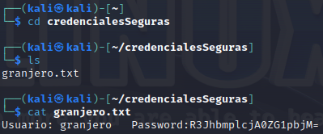
</p>

La desencodeamos:

<p align="center">
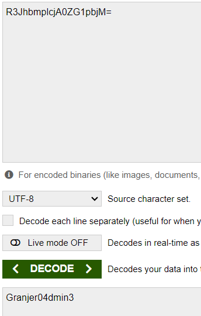
</p>

Accedemos mediante SSH para comprobar si funcionan, y sí lo hacen:

<p align="center">
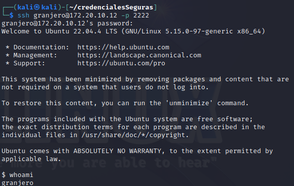
</p>

Lo primero que hacemos es listar los grupos y por suerte este usuario está en el grupo root y sudo, por lo que el escalado de privilegios es simplemente ejecutar un comando:

<p align="center">
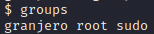
</p>

<p align="center">
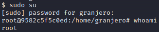
</p>

Y finalmente encontramos la flag root.txt en el directorio  /root:

<p align="center">
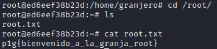
</p>


# [Contenedor Numero 2 Fallas de Identificación y Autenticación](#índice)


El sistema operativo utilizado para el desarrollo de este primer contenedor es Ubuntu Server. La vulnerabilidad elegida ha sido Fallas de Identificación y Autenticación. 

<p align="center">

</p>

## [Contenedor 2 Vulnerabilidad CVE Extra](#índice)

Para realizar la búsqueda de las CVEs añadidas como extra en la máquina, hay que tener en cuenta los siguientes puntos:
- **La CVE debe ser del año 2023 o posterior**
- **La CVE debe ser reproducible**
- **La CVE debe tener un exploit desarrollado**

CVE Extra elegida para su reproducción:

- **CVE-2024-2168**

Esta permite al atacante hacer una inyección de SQL que es posible lanzar el ataque de forma remota.

**Mitigación**

Manténer el software actualizado , Monitorea y registrar la actividad del sistema.

<p align="center">

</p>


## [Contenedor 2 Creación del CTF](#índice)

Implementación de la vulnerabilidad extra (CVE-2024-2168):

Descargamos el software y lo descomprimimos:

<p align="center">
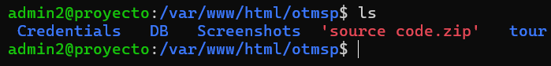
</p>

Creamos la base de datos e importamos el archivo .sql proporcionado:

<p align="center">

</p>

Modificamos la configuración de la conexión a la base de datos en los siguientes archivos:

- /user/config.php
- /admin/config.php de la carpeta admin
- /admin/package_details.php de la carpeta admin

Revisamos que funcione y que sea vulnerable:

<p align="center">
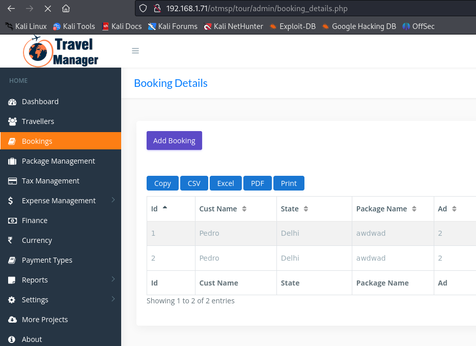
</p>

Hacemos SQLi con sqlmap:

<p align="center">
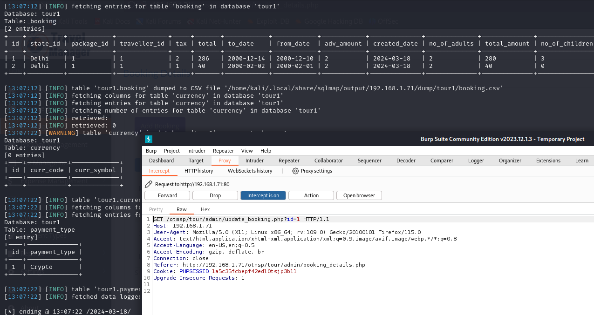
</p>


## [Contenedor 2 Análisis del Contenedor](#índice)

## [Contenedor 2 Walkthrough](#índice)

En primer lugar realizo un scaneo de puertos:


Solo tiene abiertos el 80 y el 22, el landing page es una página en mantenimiento así que hago fuzzing para ver si encuentro algo:


Encuentro un directorio, entro y parece que puedo iniciar sesión en dos paneles distintos:


Haciendo una búsqueda en google, pruebo las credenciales predeterminadas por si no las hubieran cambiado y funcionan:


Acceso con las siguientes credenciales:
- Usuario: mayuri.infospace@gmail.com
- Contraseña: admin


Investigo acerca de este software y encuentro un vulnerabilidad (SQLi) cuyo CVE es CVE-2024-2168.

Para explotar esta vulnerabilidad, intercepto la petición de "Add Expense Category":


La guardo haciendo Click Derecho > Copy To File, y la utilizo con SQLMap para intentar dumpear la base de datos:


Me llama la atención la tabla de admin, así que dumpeo la información:


Encuentro 2 potenciales usuarios:
- pedro
- andrea

Intento fuerza bruta en ambos usuarios vía SSH, y encuentro las credenciales de "pedro":


Inicio sesión y encuentro la flag user.txt. También encuentro un script en bash, el cual voy a intentar explotar para intentar escalar privilegios:


Meto una reverse shell ya que encuentro una nota indicando que el script se ejecuta como root cada 2 min., y pongo el puerto 4444 en escucha:


Finalmente obtengo la flag root.txt:


