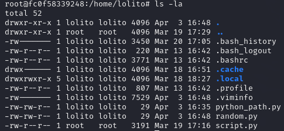

Parar esta parte hemos buscado todo los rastros que se puedan enontrar de que la han expoltado :

Papercut : 

Podemos encontrar lo regisrtos de acceso todos como administrador  y su direccion ip 

Telnet: de telnet no se ha podido encontrar ningun log ni nada

Samba : en samba no hemos podidio encontar nu log relevante

En el ususario thegrefg podemos ver que se ha instalado chisel en un usuario

En el ususario lolito  podemos ver los documentos .py

 En el ususario ampeter podemos ver los documentos creados y usados prar el esploit

 
