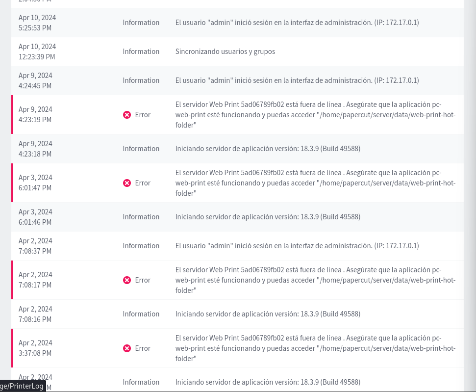
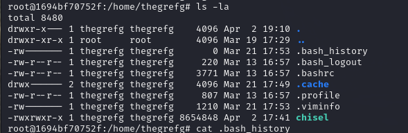
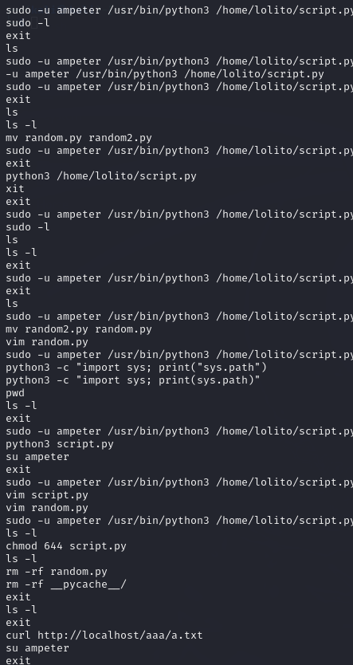
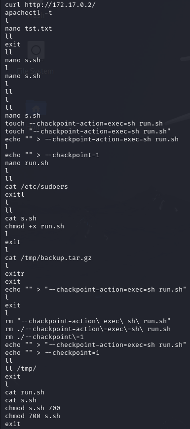
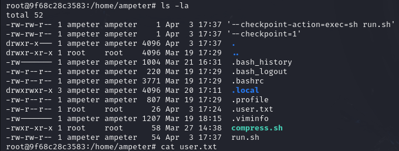

Parar esta parte hemos buscado todo los rastros que se puedan enontrar de que la han expoltado :

Papercut : 
Podemos encontrar lo regisrtos de acceso todos como administrador  y su direccion ip 

Telnet: de telnet no se ha podido encontrar ningun log ni nada

Samba : en samba no hemos podidio encontar nu log relevante

podemos ver que se ha instalado chisel en un usuario

En el .bash_history de lolito se puede encontrar que se han hecho una ejeecucion de comandos

En el .bash_history de ampeter se puede encontrar que se han hecho una ejeecucion de comandos

 i con los documentos creados
c  
  
