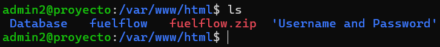
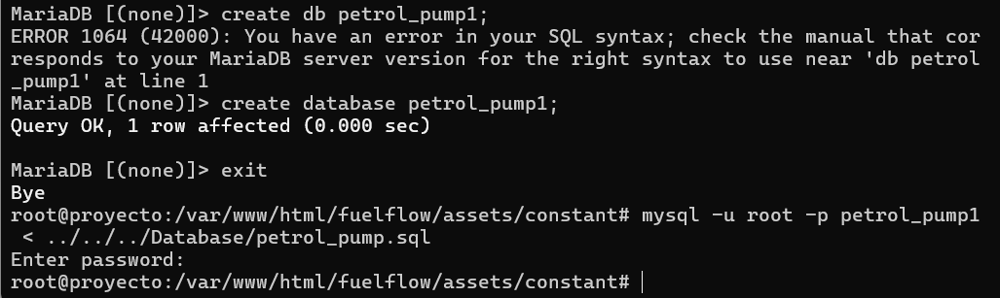
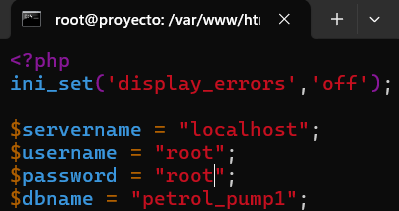
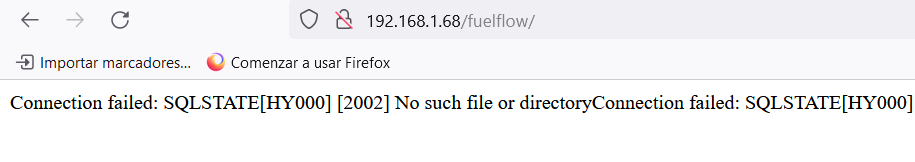
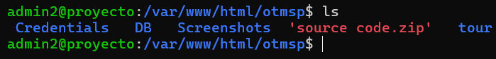
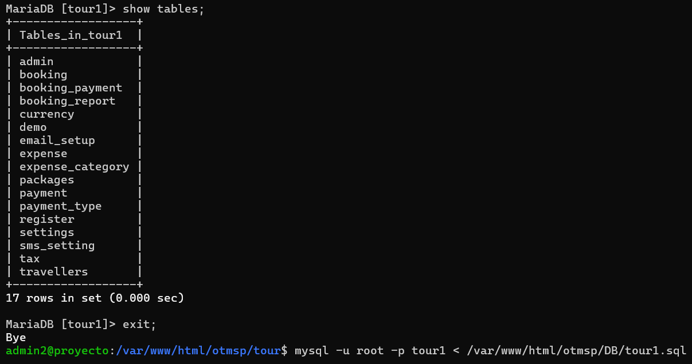
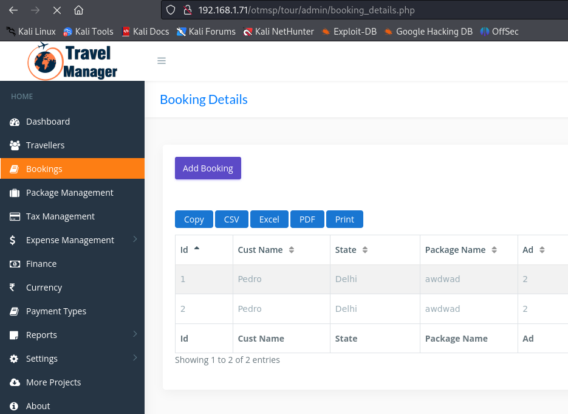

## Intento de recreación de la vulnerabilidad CVE-2024-27747

Descargamos el software y lo descomprimimos:

Creamos la base de datos e importamos el archivo .sql proporcionado:

Finalmente cambiamos la configuración del archivo con el usuario y la contraseña que realiza la conexión a la base de datos:

Aparece un error (no lo hemos podido solucionar en 2-3h):

## Recreación de la vulnerabilidad CVE-2024-2168

Descargamos el software y lo descomprimimos:

Creamos la base de datos e importamos el archivo .sql proporcionado:

Modificamos la configuración de la conexión a la base de datos en los siguientes archivos:

- /user/config.php
- /admin/config.php de la carpeta admin
- /admin/package_details.php de la carpeta admin

Revisamos que funcione y que sea vulnerable:

Hacemos SQLi con sqlmap:

