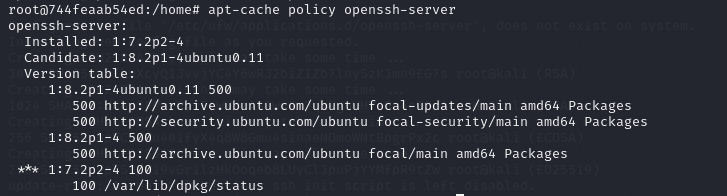
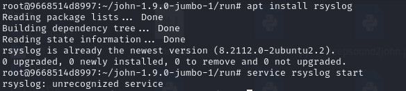
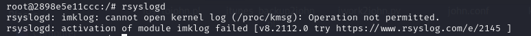

## 19/02/24 Reporte Diario
- [X] Como usar MarkDown
- [X] Que son las vulnerabilidades que no han tocado(su funcionamiento)
- [X] Como usar github Desktop

## 20/02/24 Reporte Diario

- [X] Planificación y organización del proyecto
- [X] Investigación sobre CVE y cual vamos a eligir
- [X] Planificacióm sobre que vamos hacer el proyecto(En que se va abasar)
- [X] Planificación del contenido de las maquinas(que es lo que tendrá)

## 21/02/24 Reporte Diario
- [X] Investigación sobre la primera maquina y su contenido
- [X] Pruebas de la maquinas
- [X] Primeras pruebas de la posible pagina web

## 22/02/24 Reporte Diario
- [X] Pruebas de la maquinas
- [X] Investigación y pruebas de FTP
- [X] Finalización de las pruebas de FTP

## 23/02/24 Reporte Diario
- [X] Pruebas de la maquinas
- [X] Investigación sobre como retringir a los usuarios de hacer que cosas si y que cosas no
- [X] Creación de usuarios
- [X] Planificación lógica de la maquina(Historia de la maquina)

## 26/02/24 Reporte Diario
- [X] Testing de la primera maquina
- [X] Investigación de errores

## 27/02/24 Reporte Diario
- [X] Testing de la primera maquina
- [X] Redación de la maquina
- [X] soluciones de algunos errores
- [X] Readación de la explicación de la maquina

## 28/02/24 Reporte Diario
- [X] Testing de la primera maquina
- [X] Redación de la maquina
- [X] soluciones de algunos errores

## 1/03/24 Reporte Diario
- [X] Testing de la primera maquina
- [X] Uso de la herramienta binwalk para oculta unzip dentro de una foto.
- [X] Investigación sobre python library hijacking

## 4/03/24 Reporte Diario
- [X] investigación sobre herramienta forense
    - hay fichero que no se encuentra en el los docker que complica la ejecución del forense
- [X] Error al instalar una versión anterior del Openssh-server
    - El errores es que no en los repositorios estandar no se encuentra dicha version porque es muy antigua y no cumple ya con los estandar de seguridad del sistema
       wget https://mirrors.wikimedia.org/ubuntu/ubuntu/pool/main/o/openssh/openssh-server_7.2p2-4_amd64.deb
       sudo dpkg -i --force-all openssh-server_7.2p2-4_amd64.deb
       //
       apt --fix-broken install
       apt-cache policy openssh-server

## 5/03/24 Reporte Diario
- [X] intentado solucionar el error que no deja iniciar el docker porque no tenia está libreria **libcrypto.so.1.0.0**
wget http://security.ubuntu.com/ubuntu/pool/main/o/openssl1.0/libssl1.0.0_1.0.2n-1ubuntu5.13_amd64.deb
apt install ./libssl1.0.0_1.0.2n-1ubuntu5.13_amd64.deb
Y después comentar la linea include del fichero /etc/ssh/sshd_config
    - [X] Nuevo error que no me deja iniar la maquina 

## 6/03/24 Reporte Diario
- [ ] Problemas con el servicio rsyslog, una vez que lo descarga y intenta iniciar el servico no lo encuentra.

No se a podido solucionar los errores del rsyslog y no se a podido implementar el archivo **auth.log**.

## 7/03/24 Reporte Diario

- [ ] Documentación del analisis forense en la documentación final

## 8/03/24 Reporte Diario

- [x] Documentación del analisis forense en la documentación final

## 8/03/24 Reporte Diario

- [x] Corregir la documentación de analisis de forense en la documentación final
- [ ] Intentar instalar cubecart
      Error a instalar cubecart5.0

     
## 9/03/24 Reporte Diario
- Se a intentado de todas las maneras instalar cubecart5.0 pero no se ha podido, a pesar de solucionar los errores anteriores.

## 11/03/24 Reporte Diario
- Se a intentado de todas las maneras instalar cubecart5.0 pero no se ha podido, a pesar de solucionbar los errors anteriores.

- Se a abandonó la idea de instalar cubecart

## 12/03/24 Reporte Diario
- Se intento instalar un plugin Mail Masta 1.0 pero sin exito. debido que el plugin es muy antiguo y no está actualizado. 

- Se intento que se ejecutará con el wordpress 8.0 pero se abandonó la idea por cuestione personales.

## 13/03/24 Reporte Diario
- Se está intentando instalar la version del wordpress 5.0 con versiones php 7.0 con todas sus dependencias.

- El wordpress no me le correctamente la base de datos y tampoco lee bien el archivo wp-config-sample.php e wp-config.php.

## 14/03/24 Reporte Diario
- Se ha seguido investigando el error anterior pero sin exito.
- Investigación sobre otra vulnerabilidad para introducir al wordpress por si no se consigue lo del plugin Mail Masta.

## 15/03/24 Reporte Diario
- [X] Correción explicación de la maquina de falla en el software
- [x] Proponer ideas
- [x] Investigación sobre permiso SUID a vim
- [ ] Implemeción de la vulnerabilidad sobre el permiso SUID a vim
- [x] Pulido de la maquina.

## 18/03/24 Reporte Diario
- [X] Implemeción de la vulnerabilidad sobre el permiso SUID a vim
- [X] Finalización de la maquina final
- [ ] redación de la documentación final sobre la vuelnerabilidad de SUID
 
## 19/03/24 Reporte Diario
- [X] redación de la documentación final sobre la vuelnerabilidad de SUID
- [ ] Inicio del analisi forense

## 20/03/24 Reporte Diario
- [ ] documentación del analisis forense
- [ ] Inicio del analisi forense

## 21/03/24 Reporte Diario
- [X] documentación del analisis forense
- [X] finalización del analisi forense

## 2/04/24 Reporte Diario
- [X] Descarga de la primera maquina del grupo1
- [ ] Inicio de explotación de la primera maquina del grupo1

## 03/03/24 Reporte Diario
- [X] Finalización de explotación de la primera maquina del grupo1
- [X] Feeback de la la primera maquina del grupo1

## 04/03/24 Reporte Diario
- [ ] Descarga de la segunda maquina del grupo2
- [ ] Inicio de explotación de la segunda maquina del grupo2
